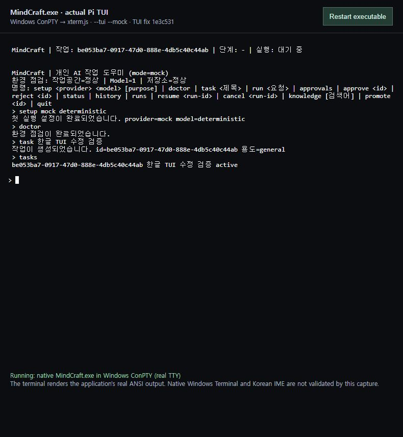
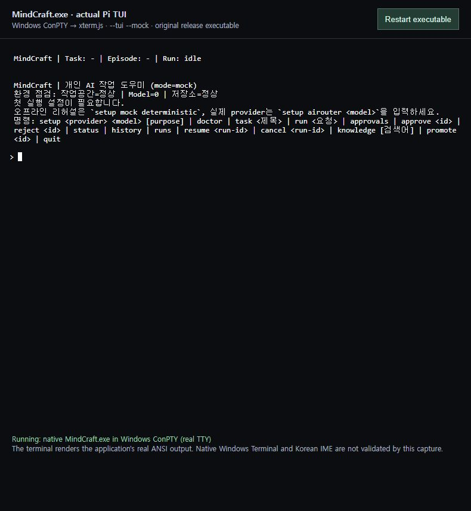
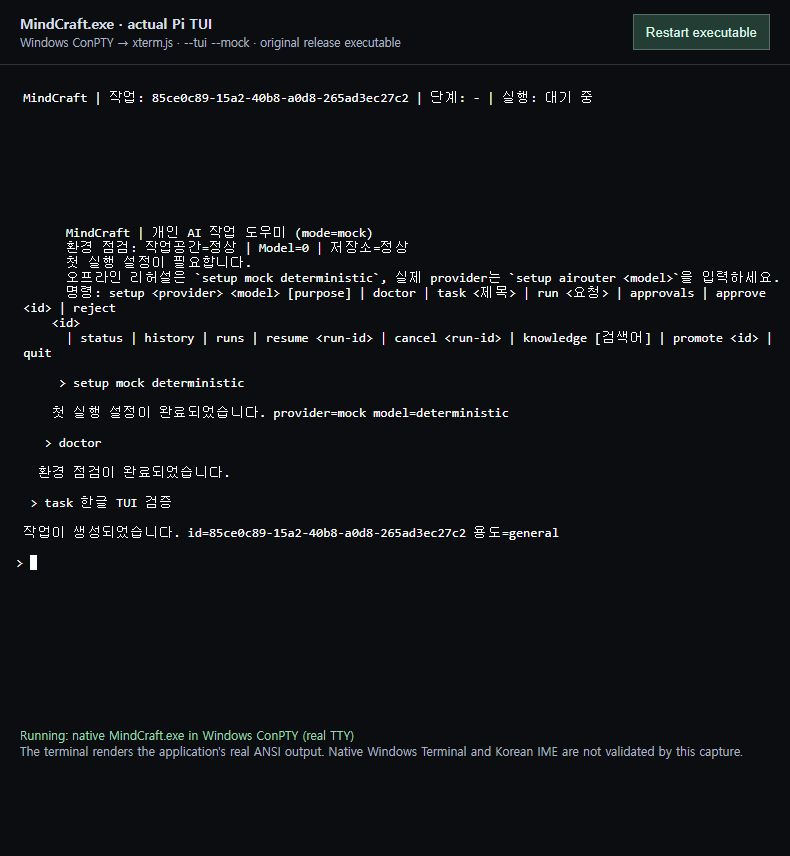

# 실제 Pi TUI 검증 및 수정 이력 — 2026-09-07

## 결론

Windows ConPTY에서 native `MindCraft.exe --tui --mock --workspace <전용경로>`를 실행해 실제 Pi TUI를 확인했다. 기존 CLI 출력 뷰어와 달리 애플리케이션의 ANSI 화면 제어, 입력창 및 상태줄을 xterm.js가 터미널로 렌더링했다. Windows Terminal 앱 자체와 IME 조합 입력 검증은 별도 미완료다.

검증 중 발견한 **출력 누적 레이아웃, 초기 설정 안내 갱신, quit 종료**의 세 가지 문제를 수정했다.

- 원본 제품 소스: `9de0f2c52f8294ba71f9072b719ae46e13ce9058`
- 수정 커밋: `1e3c5317069bb1614e473f6690a35f574bafd710`
- 대상 파일: `src/tui-runner.mjs`
- 회귀 테스트: `test/tui-native-regressions.test.mjs`
- 수정 담당: 이 Windows 검증 작업의 Codex/Astra. DDT의 구현이나 Windows 직접 검증으로 소급 표시하지 않는다.

## 실제 실행 화면

### 수정 후



mock 설정, 환경 진단, 한글 작업 생성, 상단 작업 ID, 목록 조회가 표시된다. 주변 브라우저 제목·검증 안내는 캡처용 터미널 호스트이고, 안쪽 터미널 내용은 실제 제품 TUI의 출력이다. CLI transcript를 제품 TUI처럼 재작성한 이미지가 아니다.

### 원본 초기 화면



### 수정 전 누적 출력 문제



## 재현·원인·변경

| 문제 | 수정 전 재현 | 원인 | 변경 |
|---|---|---|---|
| 누적 출력 레이아웃 | setup → doctor → task → tasks 후 기존 줄의 들여쓰기·빈 줄·줄바꿈 증가 | 이미 패딩·개행 처리된 `Text.render(120)` 결과를 다음 원문으로 재사용 | 원문 줄 배열을 보존하고 매번 현재 폭에서 한 번만 렌더링 |
| 초기 안내 갱신 | setup 성공 후에도 `Model=0`, 첫 설정 필요 안내 표시 | 생성자에서 만든 안내 문자열 고정 | 출력 시 현재 preflight에서 모델 수·설정 안내 재구성 |
| TUI quit | `quit`으로 workspace는 닫히지만 프로세스와 TUI 입력창이 잔존 | 우선 처리 분기가 `result.exit` 확인 전에 반환 | 우선 처리 분기에서도 `stop()`과 종료 콜백 실행 |

원본에서 `quit` 뒤 약 45초 동안 종료되지 않는 상태를 확인했고 Escape로 종료 코드 0을 받았다. 수정 후에는 `quit`만으로 종료 코드 0이 기록됐다.

## 실제 검증 결과

| 항목 | 결과 |
|---|---|
| 실제 TTY 분기 | `MINDCRAFT_TUI` 강제 환경변수 없이 ConPTY에서 `--tui` 실행; Pi의 한국어 화면·상태줄·입력창 표시 |
| 초기 설정과 doctor | PASS |
| 한글 제목 입력 | 붙여넣기·Enter로 생성 및 화면 표시 PASS; IME 조합 입력 검증은 아님 |
| 입력 편집 | 원본에서 `tasksx` → Backspace → Enter가 `tasks`로 처리됨 |
| 작업 ID 상단 반영·목록 | PASS |
| 원본 Escape 종료·재시작 복원 | exit 0, 이전 한글 Task 목록 복원 |
| 수정 후 설정 안내·줄 정렬 | 화면에서 갱신·정렬 유지 확인 |
| 수정 후 quit 종료 | 실제 ConPTY exitCode 0 |
| 신규 회귀 3개 | 수정 전 0/3 통과 → 수정 후 3/3 통과 |
| 전체 회귀, Node 22.19.0 | 155개 중 141개 통과 / 14개 실패; 기존 14개 유지 |
| 문법 검사 | `npm run build` 통과 |

기존 workspace 경계 필터 문제 등 14개 실패는 이번 수정 대상이 아니며 해결됐다고 주장하지 않는다. 승인·취소·LLM Run 전 과정, terminal resize, 강제 종료 process tree, Native Windows Terminal, IME는 이번 검증 범위 밖이다. 브라우저 Ctrl+C 시도는 터미널 제어 바이트가 전달되지 않아 제품 테스트 결과에서 제외했다.

## 도구 및 재현

캡처 전용 도구는 제품 의존성과 분리했다: node-pty 1.1.0, xterm.js 6.0.0, addon-fit 0.11.0, ws 8.21.3. 실행 런타임은 패키지의 Node.js 22.19.0이며 PATH에서 개발용 Node를 제외했다.

```powershell
MindCraft.exe --tui --mock --workspace 'C:\MindCraft Workspace'
```

실행 후 `setup mock deterministic`, `doctor`, `task 한글 TUI 검증`, `tasks`, `quit`을 순서대로 입력한다. 실제 터미널에서는 기본 TUI 모드도 사용할 수 있다.

## DDT 작업 산출물

사용자 지시에 따라 원인·수정 전후·패치·시험 결과·화면 증거를 DDT 에이전트 작업 산출물로 전달한다. 원격 수신 해시 확인과 DDT의 문서 기반 검토를 Windows 실행 검증과 구분해 보존한다. [DDT 인계·수신 기록](ddt-handoff/windows-tui-20260907/)을 참조한다.
