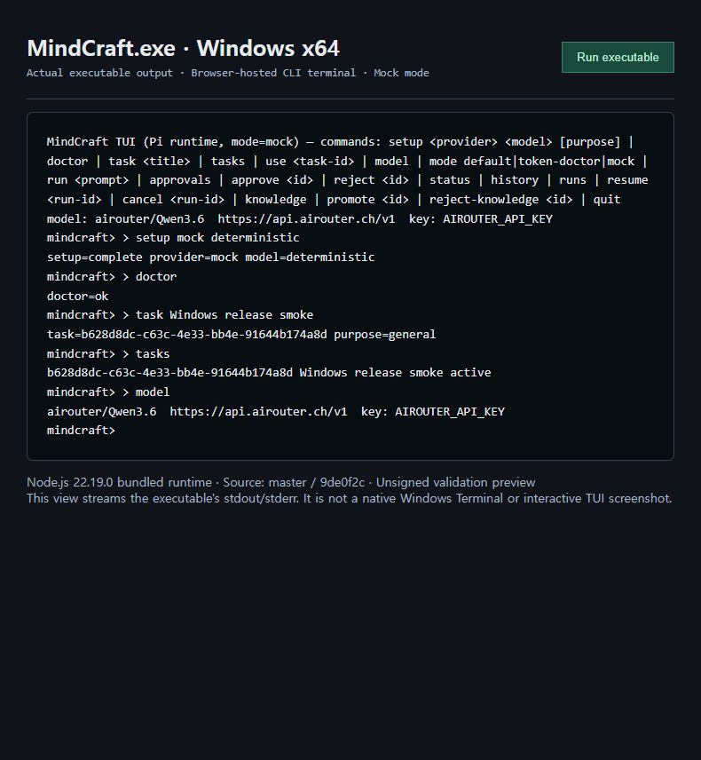

# Windows 네이티브 빌드·실행 검증 이력 (2026-09-07)

## 결론

`master`의 Windows x64 portable 실행파일 빌드와 기본 CLI 스모크 테스트가 통과했다. 전체 회귀 테스트는 동봉 Node.js 22.19.0에서 **152개 중 138개 통과, 14개 실패**했다. 따라서 이번 배포는 **서명되지 않은 검증용 프리릴리즈**이며, 정식 릴리즈 검증 완료를 뜻하지 않는다.

## 대상과 격리

- 저장소: `ddt-mindcraft/mindcraft`
- 검증 대상 브랜치: `master`
- 애플리케이션·네이티브 소스 기준 커밋: `9de0f2c52f8294ba71f9072b719ae46e13ce9058`
- 로컬 검증 브랜치: `codex/windows-master-packaging`
- 초기 clone은 당시 기본 브랜치인 `main`을 받았으나, Windows 빌드 전에 사용자 지정 `origin/master`로 전환했다. `main`에 대한 초기 관찰은 이 검증 결과에 포함하지 않는다.
- 기존 AI-DLC 작업 폴더와 별도 Git clone, 배포 폴더, 실행 workspace, 보고서 폴더를 사용했다.
- 제품의 JavaScript 및 native C 소스는 변경하지 않았다. Windows 빌드·스모크 스크립트를 추가하고 기존 manifest 생성기의 파일 해싱을 최대 32개 병렬 처리로 조정했다.

릴리즈 태그는 이 문서·재현 스크립트를 포함한 커밋을 가리킨다. 패키지 내부 `release-manifest.json`의 `sourceRevision`은 실제 제품 바이너리의 기준인 위 `9de0f2c…`를 유지한다. 문서 반영 커밋을 제품 코드 재빌드로 표현하지 않는다.

## 환경과 결과

| 항목 | 환경·결과 |
|---|---|
| 실행 환경 | Windows x64, OS 10.0.26200.0; 로컬 PC의 제한된 실행 환경, clean VM 아님 |
| 빌드 도구 | Visual Studio 2022 C++ x64, `/O2 /MT /W3` |
| 개발용 Node/npm | Node.js 24.13.0 / npm 11.6.2 |
| 배포 런타임 | 공식 Node.js 22.19.0 Windows x64; 다운로드 ZIP을 공식 SHASUMS256.txt와 대조 |
| 의존성 | `master`의 package-lock.json으로 `npm ci` 성공 |
| 문법 검사 | `npm run build` 통과 |
| 네이티브 빌드 | `MindCraft.exe`, `wincred-helper.exe` 생성 성공; 기존 C 문자열 API 사용에 대한 컴파일러 경고 있음 |
| 개발용 Node 회귀 | 152개 중 137개 통과 / 15개 실패 |
| 동봉 Node 회귀 | 152개 중 138개 통과 / 14개 실패 |
| 배포 무결성 | 27,602개 파일의 크기·SHA-256 재검증 통과 |
| SBOM | CycloneDX JSON 생성 |
| 코드 서명 | 미서명 |

`MindCraft.exe` SHA-256:

```text
11afe1e7db027e278f5c9ef060d6ea5f4b27fb7446ec9b4ad285a09f5bb16717
```

## 실행파일 스모크 테스트

실제 native `MindCraft.exe`를 실행하고 stdin/stdout 파이프로 명령을 순서대로 전달했다. PATH에서 Node 설치 경로를 제외했고, 모델 관련 credential 환경변수를 제거한 mock 환경을 사용했다.

| 시나리오 | 결과 |
|---|---|
| PATH의 Node 없이 동봉 runtime으로 실행 | PASS |
| 한글·공백이 있는 절대 workspace 인자 전달 | PASS |
| `setup mock deterministic` | PASS |
| `doctor` | `doctor=ok` |
| 한글 제목으로 Task 생성 및 `status` 조회 | PASS |
| `quit` 종료 | exit code 0, stderr 없음 |
| 별도 프로세스로 재시작 후 `tasks` 조회 | 이전 Task 복원 PASS |
| workspace journal에 Task 보존 | PASS |

이는 CLI 명령·입출력 검증이다. 대화형 TUI 화면, 키보드 이벤트, 한글 IME 검증으로 대체할 수 없다. mock 모델 설정을 확인했지만 이 스모크에서 `run`을 실행한 것은 아니며, 실제 LLM 호출도 수행하지 않았다.

## 실제 실행 화면



Windows 콘솔 창이 캡처 도구에 노출되지 않아, **실제 native `MindCraft.exe` 프로세스의 stdout/stderr를 로컬 브라우저 터미널에 실시간 연결한 화면**을 캡처했다. 저장된 로그를 재현하거나 제품 화면을 합성한 것이 아니다. Windows Terminal 자체 또는 대화형 Pi TUI의 스크린샷으로 해석하면 안 된다.

화면에는 mock 설정, `doctor=ok`, Task 생성 및 목록 조회가 보인다. 추가로 mock 설정 후에도 `model` 표시가 Airouter 기본값을 유지하는 표시 불일치가 관찰됐다. 실제 provider 호출은 수행하지 않았고 이 현상을 정상 모델 전환 증거로 사용하지 않는다.

## 동봉 Node에서 실패한 14개 테스트

| 분류 | 개수 | 확인된 원인 |
|---|---:|---|
| CLI Task persistence/selection 테스트 | 8 | `URL.pathname`을 Windows 파일 경로로 사용해 `C:\C:\...` 경로 생성 |
| workspace lock 프로세스 테스트 | 1 | Windows 절대 경로를 ESM import specifier로 전달; `file:` URL 필요 |
| execution-root 기대값 | 1 | Unix 절대 경로를 전제로 한 단정문 |
| Knowledge 임시 파일 | 2 | 하드코딩한 `/tmp`가 `C:\tmp`로 해석되어 제한된 실행 환경에서 EPERM |
| symlink 탈출 테스트 | 1 | 실행 환경에서 테스트 symlink 생성이 EPERM으로 실패 |
| Knowledge workspace fallback | 1 | 제품의 Windows 경로 경계 검사 결함 |

마지막 항목은 정식 릴리즈를 막는 제품 문제다. `src/knowledge.mjs`의 `scopePath`는 `/` 구분자로 상위 경로를 검사하지만 Windows `path.relative`는 `\`를 반환한다. 그 결과 테스트에서 제공한 `../outside.md` 후보가 필터를 통과했다. 해당 테스트는 이미 제공된 파일 내용으로 필터를 검사하므로, 이 결과만으로 제한 없는 디스크 읽기를 입증한 것은 아니다.

Node.js 24에서 추가로 실패한 1개 테스트는 릴리즈 리허설 하위 테스트 출력 형식의 차이였고, 동봉 Node.js 22에서는 통과했다. 실패 테스트를 삭제하거나 성공으로 바꾸지 않았다.

## 빌드 중 조치

1. Windows PowerShell의 `Copy-Item`으로 중첩된 의존성 파일을 복사할 때 긴 경로 오류가 발생했다. Node의 `fs.cpSync`로 복사하도록 변경했다.
2. Windows PowerShell에서 `node -e` 인자의 따옴표 전달 문제를 수정했다.
3. 전체 파일 순차 해싱의 지연을 줄이기 위해 manifest 생성기의 동시 처리 수를 32개로 제한했다. 생성 이후 전체 파일을 별도로 재검증했다.

## 재현 방법

검증 디렉터리를 다음과 같이 구성한다.

```text
windows-validation/
  repo/         이 저장소의 clone
  dist/         빌드 결과 및 build-cache
  workspaces/   스모크 테스트 전용 데이터
  reports/      로그
```

`repo/`에서 실행한다. Windows C++ 빌드 도구, Node/npm, Git, tar 및 공식 Node 다운로드 서버 접근이 필요하다.

```powershell
New-Item -ItemType Directory -Force ../reports,../workspaces | Out-Null
npm.cmd ci --no-audit --no-fund
npm.cmd run build
npm.cmd test
powershell.exe -NoProfile -ExecutionPolicy Bypass -File scripts/build-windows.ps1
& ../dist/windows-package/current/runtime/node.exe --test 'test/*.test.mjs'
node scripts/smoke-windows.mjs
```

회귀 명령은 위의 알려진 실패로 인해 0이 아닌 종료 코드를 반환할 수 있다. 다른 소스 버전을 빌드할 때에는 이전 파일이 섞이지 않도록 새 출력 폴더를 사용한다. 빌드 스크립트의 `-OutputRoot`로 지정할 수 있고, 기본 스모크 스크립트는 위의 표준 디렉터리 구성을 사용한다.

## 배포 및 미검증 범위

프리릴리즈 ZIP의 폴더 전체를 압축 해제한다. `MindCraft.exe`만 분리해서 실행할 수 없다. 기본 작업 위치의 혼동을 피하려면 실제 존재하는 전용 workspace를 명시한다.

```powershell
.\windows-package\MindCraft.exe --cli --mock --workspace 'C:\MindCraft Workspace'
```

실행 후 `setup mock deterministic`, `task 테스트`, `status`, `quit` 명령으로 기본 동작을 확인할 수 있다.

미검증: NSIS installer 설치·업데이트·제거, clean Windows VM, Authenticode 서명, 대화형 TUI와 한글 IME, 실제 모델 호출, 실제 Credential Manager 쓰기·읽기, 강제 종료 시 process tree 회수, 테스트 범위를 넘는 장경로 동작.

## 증거

[검증 로그 디렉터리](validation/2026-09-07-windows/)에 테스트·빌드·스모크·무결성 로그를 보존했다. 공유 전에 로컬 사용자 폴더와 검증 경로를 자리표시자로 치환하고 줄 끝 공백을 정리했다. 실패 내용과 테스트 개수는 그대로 유지했다.
